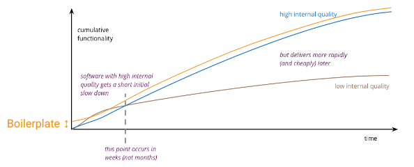
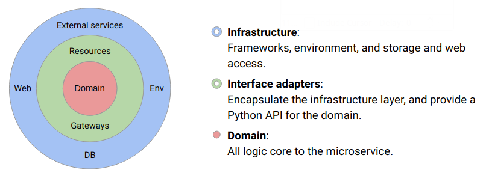
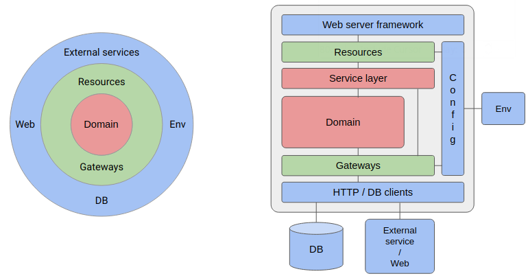

# The anatomy of a microservice

This document defines a general software architecture for microservices
at ML6, the anatomy of a microservice as you will.

A good software architecture enhances the internal quality of a service,
which enables the delivery of new features in the future at a faster
pace and with greater quality.

Capturing this architecture in a boilerplate

* Saves time at the start of each project
* Prevents projects running into problems down the line due to bad
   architecture
* Facilitates consistent design and understanding across projects

## The clean architecture - ML6 tailored

The general architecture is based on the popular
[clean architecture](https://blog.cleancoder.com/uncle-bob/2012/08/13/the-clean-architecture.html).
While the original design is clearly more focused on strict OOP
languages and implementations, it holds a lot of valuable insights. We
extracted these core insights into a simplified, ML6 tailored version

The architecture consists of concentric circles, ranging from low-level
components at the outer edges, to high-level components at the core.
While our representation contains three layers, more layers can be added
as needed, as long as they conform to the following rules:

* Dependencies can only point inward. Inner circles should be
  independent of outer circles' specifics. This is known as the
  dependency rule.

* There should be clear and simple interfaces between layers. While it
  is not necessary to define these explicitly as in OOP languages, clear
  boundaries need to be established.
  
* Only isolated, simple data structures should be passed across these
  boundaries. Think Python dictionaries, lists, or builtin types. No
  data types specific to outer layers should be passed to inner layers.
  
  
## Mapping the architecture on a microservice

We can map this clean architecture on the internals of our microservice.
Well designed microservices should display a consistent internal
structure composed of some or all of the described layers.

The microservice boilerplate aims to provide a minimal common structure
shared by all microservices. Examples will be added containing the
additional components.

Description

* Act as a mapping between the exposed application protocol (eg. HTTP)
  and Python. 
* Validate requests and responses against application protocol.

In boilerplate

* Flask
* Connexion

Description 

* Act as a mapping between the web server framework and the
service domain. 
* Thin layer for sanity checking requests and providing
protocol specific responses.

In boilerplate

* `app/flask/__init__.py`
* `app/flask/error_handler.py`
* `app/flask/routes.py`
* `configs/swagger.yaml`

Description 

* Clients to handle connections to external datastores and
services 
* HTTP-client: Client that understands the underlying protocol to handle
  the request-response cycle.
* DB-client: Provide python representation of data in datastores.

In boilerplate

* Python requests
* Google Cloud clients

Description

* Encapsulates message passing with a remote service, marshalling
  requests and responses from and to Python.
* Isolates domain from details in the database access code. 

In boilerplate

* `app/io/*.py` (see Pets example)

Description:

* Defines the interface of the domain with its set of available operations.
* Can be reused by multiple protocol clients; HTTP, GRPC, Queue reader,
  ...
* Part of the domain. For simple services, the service layer might be
  the full domain.

In boilerplate

* `app/core.py`
* `app/exceptions.py`

Description

* Contains the actual service logic. 
* The domain consists of pure Python with some core libraries. It is
  independent of any used frameworks and IO clients, and only depends on
  the interface of the resources and gateways. 
  
In boilerplate

* The domain is service specific, but should be grouped in a Python
  module or package at the `app/` level.
  

Description

* Reads and groups the configuration of the service.
* All configurable parameters of the service should be extracted as
  config, so they can be set and changed in the environment at run time. 
  
In boilerplate

* `config.py`

## Advantages of the clean architecture

**Independent of externals**  
When any of the external parts of the system become obsolete, like the
database, or the web framework, you can replace those obsolete elements
with a minimum of fuss. 

**Scalable and maintainable**  
A modular architecture allows for scaling without an explosion in
complexity. New modules can be added independently of others. Multiple
developers can work in parallel on different modules.

**Deploy everywhere**  
Since the configuration is separated, the same code can be deployed in
different environments without changes.

**Testable**  
The domain logic is easily testable since it is pure Python. IO modules
and external services can easily be mocked since they are clearly
separated.